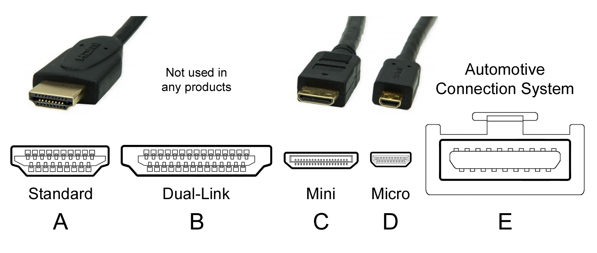

## 1. What Is HDMI?

**HDMI** stands for **High-Definition Multimedia Interface**.

It is a **digital cable and standard** used to transmit:

-   📺 **Video**
-   🔊 **Audio**

**over a single cable**, from one device to another.

In simple terms:

>   **HDMI = one cable for picture + sound**

## 2. Where Is HDMI Used?

HDMI is *everywhere*:

-   TVs 📺
-   Monitors 🖥️
-   Laptops 💻
-   Game consoles 🎮 (PS, Xbox, Switch)
-   Set-top boxes / TV boxes
-   Projectors

If it has a screen, it probably has HDMI.

## 3. What Does an HDMI Cable Carry?

An HDMI cable can carry:

-   High-resolution video (1080p, 4K, 8K)
-   Multi-channel audio (stereo, surround sound)
-   Control signals (CEC)
-   Copy protection data (HDCP)

All digitally — no quality loss like old VGA.

## 4. HDMI vs Old Display Cables

| Cable | Video | Audio      | Digital |
| ----- | ----- | ---------- | ------- |
| VGA   | ✅     | ❌          | ❌       |
| DVI   | ✅     | ❌ (mostly) | ✅       |
| HDMI  | ✅     | ✅          | ✅       |

HDMI replaced most older connectors because it’s **simple and universal**.

## 5. HDMI Versions (What Actually Matters)

HDMI versions affect **maximum resolution & refresh rate**.

| HDMI Version | Typical Max     |
| ------------ | --------------- |
| HDMI 1.4     | 4K @ 30Hz       |
| HDMI 2.0     | 4K @ 60Hz       |
| HDMI 2.1     | 4K @ 120Hz / 8K |

👉 Most TVs today support **HDMI 2.0 or 2.1**.

⚠️ Important:

>   **The cable AND both devices must support the version.**

## 6. HDMI Cable Types (This Confuses Beginners)

You’ll see labels like:

-   High Speed HDMI
-   Premium High Speed
-   Ultra High Speed

### Simple rule:

-   **1080p / 4K 60Hz** → High Speed HDMI
-   **4K 120Hz / 8K** → Ultra High Speed HDMI

💡 Brand doesn’t matter much — **certification does**.

## 7. HDMI Connectors You Should Know

### Standard HDMI (Type A)

-   Most common
-   TVs, monitors, consoles

### Mini HDMI (Type C)

-   Some cameras

### Micro HDMI (Type D)

-   Small devices (action cameras)

All carry the same signal — just different sizes.

## 8. Audio Features (Why HDMI Is Great for TVs)

HDMI supports advanced audio formats:

-   Dolby Digital
-   DTS
-   Dolby Atmos (via HDMI 2.1 / eARC)

### ARC & eARC (TV users)

-   **ARC**: TV sends audio back to soundbar
-   **eARC**: Higher quality, less compression

One HDMI cable can handle everything.

## 9. HDMI CEC (Hidden but Useful)

**CEC** lets devices control each other:

-   TV remote controls soundbar
-   Console turns TV on automatically

Names differ by brand:

-   Samsung: Anynet+
-   Sony: Bravia Sync
-   LG: Simplink

Same idea, different marketing.

## 10. Common Beginner Problems ❌

❌ 144Hz not available on monitor

→ HDMI version too old

❌ No sound on TV

→ Audio output not set correctly

❌ Screen flickering

→ Bad or too-long cable

❌ Adapter confusion

→ HDMI → DP ≠ DP → HDMI

## 11. HDMI vs DisplayPort (Quick Choice Guide)

| Use Case                    | Choose       |
| --------------------------- | ------------ |
| TV / Console                | HDMI         |
| PC + Monitor                | DisplayPort  |
| Home theater                | HDMI         |
| High-refresh gaming monitor | DP (usually) |

HDMI is **consumer-electronics first**.

## 12. When Should You Use HDMI?

Use **HDMI** if:

-   You connect to a TV
-   You use a game console
-   You want easy plug-and-play
-   You care about home audio features

## 13. TL;DR

-   **HDMI = universal audio + video cable**
-   Perfect for TVs and home entertainment
-   HDMI 2.0 → 4K 60Hz
-   HDMI 2.1 → 4K 120Hz
-   Simple, reliable, everywhere

